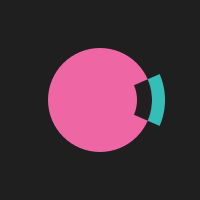

<p align="center">
  
</p>

# Nikki

A native Android client for [Memos](https://usememos.com) with integrated Todoist-style task management, built with Compose Multiplatform and inspired by the Windows Phone Metro design language.

The name comes from the Japanese word 日記 (nikki), meaning diary.

## Why Nikki

Memos is a great self-hosted note-taking tool, but its mobile experience is limited to a PWA. Nikki exists to be a proper native client that feels at home on your phone — fast, offline-capable, and opinionated about how notes and tasks should work together.

### Why Windows Phone

The Metro design language was the most readable, information-dense, and distraction-free mobile UI ever shipped. Large typography, flat surfaces, no chrome — it respected both content and the person reading it. Nikki borrows that philosophy: panorama pivot navigation, all 20 WP8 accent colors, and the principle that UI should get out of the way.

### Why Tasks Inside Notes

Most people track tasks in their notes anyway — `- [ ] buy milk` scattered across memos. Nikki parses those checkboxes and gives them structure: due dates, priorities, reminders, grouping. Your notes stay as plain markdown. The task layer is derived, not duplicated. One source of truth, two ways to see it.

### The Logo

Inspired by the Google Foobar challenge logo, adapted into a circle. A pink circle carries a 47-degree annular wedge on the right — black where it overlaps, teal where it extends beyond. Construction details are in [LOGO.md](LOGO.md).

## Features

**Memos**
- Full CRUD with the Memos API (create, edit, pin, archive, delete)
- Rich markdown rendering: headings, bold/italic, strikethrough, code blocks, tables, links, task checkboxes
- Media attachments with authenticated image loading
- Emoji reactions and comments
- Visibility control (private, protected, public)
- Pull-to-refresh sync with configurable interval

**Tasks**
- Todoist-inspired syntax parsed from markdown checkboxes (see [TASK_FORMAT.md](TASK_FORMAT.md))
- Due dates (ISO and natural: today, tomorrow), times (12h/24h), priorities (p1-p3), reminders, tags
- Group by due date, list, priority, source memo, or status
- Sort by due date or priority
- Parser doctor: inline error/warning detection with typo suggestions
- Android notifications with 4 priority channels (p1 bypasses DND)

**Explorer**
- Activity calendar with memo density heatmap
- Tag browser with counts
- Date and search filtering
- Archived memos view

**Offline**
- Room database cache for offline reading
- Pending sync queue for offline edits (auto-drains on reconnect)
- Sync status banner with last-synced time

**Personalization**
- 3 themes: dark, light, AMOLED black
- 20 WP8 accent colors (lime, green, emerald, teal, cyan, cobalt, indigo, violet, pink, magenta, crimson, red, orange, amber, yellow, brown, olive, steel, mauve, taupe)
- Configurable week start day, default visibility, default reminder

**Backup**
- Export/import memos as JSON
- Backup rules exclude credentials from cloud backup

## Requirements

- Android 8.0+ (API 26)
- A running [Memos](https://github.com/usememos/memos) instance (v0.22+)
- JDK 11+

## Building

```bash
# Clone
git clone https://github.com/avinal/nikki.git
cd nikki

# Build debug APK
./gradlew :androidApp:assembleDebug

# Install on connected device
./gradlew :androidApp:installDebug

# Run tests
./gradlew :composeApp:testDebugUnitTest
```

The project uses Gradle 9.4 with the Kotlin Multiplatform plugin. Android Studio or IntelliJ IDEA with the Compose Multiplatform plugin is recommended for development.

## Installation

Download the latest APK from [Releases](https://github.com/avinal/nikki/releases), or build from source using the instructions above.

On first launch, enter your Memos server URL and an access token (generate one in your Memos account settings).

## Tech Stack

| Layer | Technology |
|-------|-----------|
| UI | Compose Multiplatform 1.11, Material 3 |
| Language | Kotlin 2.3 |
| Networking | Ktor 3.5 |
| Database | Room 2.8 (multiplatform) |
| Image loading | Coil 3.4 |
| Background work | WorkManager + AlarmManager |
| Serialization | kotlinx.serialization |
| Date/time | kotlinx-datetime 0.8 |

## Project Structure

```
nikki/
├── androidApp/          # Android app shell (MainActivity, receivers)
├── composeApp/          # Kotlin Multiplatform shared code
│   └── src/
│       ├── commonMain/  # Shared UI, domain, API, parser, database
│       ├── androidMain/ # Android notifications, file picker, alarms
│       └── iosMain/     # iOS stubs (scaffolded, not active)
├── gradle/              # Version catalog and wrapper
├── LOGO.md              # Logo construction spec
└── TASK_FORMAT.md       # Task syntax reference
```

## Disclaimer

This project was built almost entirely with the help of AI (Claude). I am not an Android developer by trade, and this is my first serious mobile app. Considerable effort has been made to avoid security vulnerabilities, bloat, and deprecated patterns - including a dedicated security review; but gaps may exist.

If you find a security issue, bug, or anything concerning, please [open an issue](https://github.com/avinal/nikki/issues) or email me at ripple@avinal.space.

## Acknowledgements

- [Memos](https://github.com/usememos/memos) by the usememos team — the self-hosted note-taking tool that Nikki connects to
- [JetBrains](https://www.jetbrains.com/compose-multiplatform/) — Compose Multiplatform framework
- The Windows Phone design team — for proving that flat, typography-first UI is timeless
- [Google Foobar](https://foobar.withgoogle.com/) — inspiration for the logo

## License

[MIT](LICENSE)
